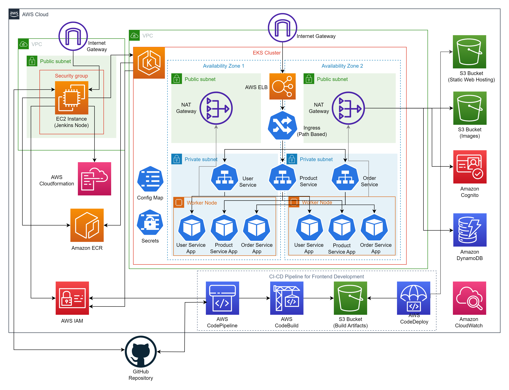
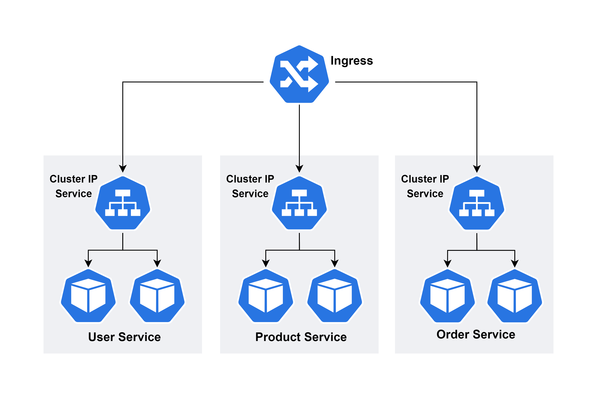

<h1 align="center">🛒 Marketplace Platform 🛍️</h1>

<h2 align="center">🏢 System Architecture (Current) 🛠️</h2>

Marketplace Platform is a web application that allows users to either buy or sell products. The platform is developed using the Spring Boot and Angular frameworks, integrated with multiple AWS services, ensuring scalability, reliability, and security of the system.

<h2 align="center">📚 Table of Contents 📚</h2>

- [System Design](#system-design)
- [Development Methodology](#development-methodology)
- [System Attributes](#system-attributes)
- [System Review and Future Improvements](#system-review-and-future-improvements)

<h2 align="center" id="system-design">🔧 System Design 🔧</h2>
The system architecture is composed of five core components: the front-end, back-end, database, Identity Service, and storage service, all working in collaboration to meet the system's functional requirements.
The implementation of these components, uses the following frameworks and services:

- Back-End Services (Spring Boot)
- Front-End Web (Angular)
- Database (Amazon DynamoDB)
- Identity Service (Amazon Cognito)
- Storage Service (Amazon S3)

### Back-End Services
- The back-end is built using the Spring Boot framework, adhering to a microservices architecture. The back-end logic is divided into three distinct microservices—`User`, `Product`, and `Order`—each responsible for isolating specific functionalities. These services interact with one another as needed.
- Microservices are deployed on `AWS Elastic Kubernetes Service` (EKS), offering robust scalability and high reliability. Each microservice is exposed internally within the EKS cluster via ClusterIP services. An Ingress service, managed by an Ingress controller integrated with the cluster, is used to route external traffic to the appropriate microservice based on URL path mapping.

#### Communication of Microservices
- Inter-pod communication occurs over the Kubernetes network, ensuring secure and reliable data exchange. The pods are designed to be stateless, with persistent data stored in the database, enabling horizontal scaling without risk of data loss. Pods communicate with each other through services using DNS names provided by the Kubernetes DNS service. 
- Communication with external services like Amazon DynamoDB and Amazon S3 is facilitated via a NAT Gateway, allowing pods within private subnets to access the internet. Applications running in the pods utilize the AWS SDK for Java, which offers a high-level API that abstracts the underlying HTTP API interactions with AWS services. The SDK includes built-in retry logic and error handling, enhancing the system's resilience to transient failures.

#### Design Patterns
- The back-end services are designed using the `Repository` pattern, which abstracts the data access logic from the business logic. This pattern allows for easy unit testing and code maintainability.
- `Builder` pattern is used with AWS SDK clients to create service clients with default configurations. This pattern simplifies the client creation process, making it easier to manage configurations across the application and improving code readability.
- Security Filter Chain uses `Chain of Responsibility` pattern to process incoming requests and apply security checks in a sequential manner. This pattern allows for easy addition or removal of security filters without modifying the existing codebase.
- Trasfering data between components is done using `Data Transfer Objects (DTOs)`, which are lightweight objects that contain only the necessary data to transfer between components. This pattern helps in reducing the amount of data transferred, improving performance.
- Spring Security transforms the JWT token into an Authentication object using the `Adapter` pattern. This Authentication object is subsequently employed throughout the microservices to authorize requests and verify user identity.
- The `Facade` pattern is employed to abstract the logic of user information retrieval by encapsulating the functionalities of Amazon DynamoDB within a single class. This approach minimizes the need for direct network resource access, thereby improving performance and maintainability.

### Front-End Web
- The front-end is developed using the Angular framework, providing a responsive and interactive user interface. The Angular application is hosted on an `Amazon S3` bucket, with static website hosting enabled. The front-end communicates with the back-end services via RESTful APIs exposed by backend microservices.

### Database
- The system uses `Amazon DynamoDB`, a fully managed NoSQL key-value store from AWS, offering seamless scalability, high availability, and low latency. It efficiently stores user data, product details, and orders, with Global Secondary Indexes (GSIs) enabling optimized queries across various attributes. The database is integrated with back-end microservices for data storage and retrieval.

### Identity Service
- Amazon Cognito, AWS's fully managed identity and access management service, is used to handle user authentication, authorization and management in the system. Integrated with the user microservice, it secures access to the Marketplace Platform. Custom Attributes in Cognito are used to implement Role-Based Access Control (RBAC) for users. 

### Storage Service
- `Amazon S3`, AWS's scalable object storage, is used to store product images uploaded by sellers. With high durability, availability, and scalability, S3 is an ideal option for static asset storage. The backend leverages the AWS SDK to generate pre-signed URLs for image uploads, allowing the frontend to directly upload images via PUT requests. Uploaded images are publicly accessible through their object URLs.

<h2 align="center" id="development-methodology">🔨 Development Methodology 🔨</h2>
System development follows the Agile methodology, with an emphasis on iterative development, continuous integration and continuous deployment (CI/CD). Two Separate CI/CD pipelines are implemented for the front-end and back-end.

### Front-End CI/CD Pipeline
- The front-end CI/CD pipeline is implemented using AWS CodePipeline, a fully managed continuous delivery service. The pipeline consists of multiple stages, including `Source`, `Build`, and `Deploy`.
    - **Source**: The pipeline is triggered by changes to the specified branch in the GitHub repository. The source code of the specified branch is fetched and put into the S3 bucket of the pipeline (artifact bucket). AWS CodeConnect is used to connect the pipeline to the GitHub repository with necessary authentication keys.
    - **Build**: This stage consists of 3 sub-stages: `Pre-Build`, `Build`, and `Post-Build`. AWS CodeBuild is used to execute these sub-stages.
        - **Pre-Build**: The pipeline installs the necessary dependencies using npm and Angular CLI.
        - **Build**: The Angular application is built to generate the production-ready code. Build artifacts will be stored in the S3 bucket of the pipeline, at the end of this stage.
        - **Post-Build**: The built application is tested to ensure its correctness. (This stage has not been implemented yet).
    - **Deploy**: The built application is deployed to an S3 bucket with static website hosting enabled. The pipeline is configured to automatically deploy the application upon successful build completion. AWS CodeDeploy is responsible for this stage of the pipeline.

Refer to the `front-dev-cicd` branch for the implementation of the front-end CI/CD pipeline.

### Back-End CI/CD Pipeline
- The back-end CI/CD pipeline is implemented using `Jenkins`, an open-source automation server. The pipeline consists of multiple stages, including `Source`, `Package`, `Build`, `Test`, and `Deploy`.
    - **Source**: The pipeline is triggered by polling the specified branch in the GitHub repository for changes, cloning the repository, and checking out the specified branch in the Jenkins workspace.
    - **Package**: Maven downloads dependencies and packages the application into JAR files
    - **Test**: Automated tests are executed against the packaged application to ensure its correctness and stability. (This stage has not been implemented yet)
    - **Build**: Docker images of the application are built, tagged with the latest commit hash, and pushed to Amazon Elastic Container Registry (ECR).
    - **Deploy**: Docker images are deployed to the EKS cluster, updating running pods with the latest application version. Using kubernetes manifests, allows updates to both the application and the deployment configuration.
- Jenkins worker is deployed on an EC2 instance, with necessary plugins installed to support the pipeline stages. The pipeline is configured to run automatically upon changes to the specified branch in the GitHub repository.

Refer to the `eks-jenkins-pipeline` branch for the implementation of the back-end CI/CD pipeline.

### Back-End Development on Local Machine
- The system supports running back-end services locally through three methods:
    - **Non-Dockerized**: Developers can run the services natively on their local machines using the Spring Boot Maven plugin. In this setup, service discovery is managed by the Eureka Server, and Spring Cloud Gateway is used for API routing and traffic management. Refer to the branch `local` for this setup.
    - **Docker Compose**: Developers can containerize and orchestrate services using Docker Compose. This approach encapsulates services within Docker containers, which communicate within a Docker Compose-defined network. Service discovery is facilitated through Docker Compose service names, and NGINX acts as a reverse proxy, directing client requests to the appropriate services based on predefined rules.
    Refer to the branch `docker-compose` for this setup.
    - **MiniKube Kubernetes**: Developers can deploy services within a MiniKube-managed Kubernetes cluster. Here, services run as Kubernetes pods, and service discovery is handled via Kubernetes service names. An Ingress resource is configured to manage external access, routing incoming traffic to the appropriate services. The Ingress endpoint is made accessible to the host machine using a MiniKube tunnel.
    Refer to the branch `minikube-kubernetes` for this setup.

<h2 align="center" id="system-attributes">📈 System Attributes 📈</h2>

### Reliability

#### Availability
- The system ensures high availability by running multiple instances of each microservice within an EKS cluster. Kubernetes handles pod failures with automatic restarts, while the cluster’s Multi-AZ deployment guarantees availability even if an entire AZ fails.
- Amazon DynamoDB is built for high availability and durability, with data automatically replicated across multiple Availability Zones (AZs) within a region. DynamoDB Global Tables further boost availability by replicating data across multiple regions.
- Amazon S3 provides high availability by storing data across multiple devices in multiple facilities within a region, ensuring that images are always accessible.

### Security

#### Application Security
- Environment variables containing sensitive information, such as database credentials and API keys, are stored securely in Kubernetes Secrets.  
- Integration with Amazon Cognito, ensures only users with verified Email accounts can access protected resources within the system.  
- IAM roles and policies are used to restrict access to AWS resources, ensuring that only authorized entities can interact with the system.  

#### Network Security
- Pods running Application Services are deployed in a private subnet (with ClusterIP services) and are not directly accessible from the internet. The Ingress controller is deployed in a public subnet, providing a single entry point to the cluster from the public internet. 
- Security Group of the EC2 instance hosting Jenkins is configured to allow inbound traffic only via SSH port 22, ensuring secure access to the server.

#### Data Security
- Data stored in Amazon DynamoDB is encrypted at rest using AWS Key Management Service (KMS) managed keys. Amazon S3 data is encrypted at rest using server-side encryption with Amazon S3-managed keys (SSE-S3).  

<h2 align="center" id="system-review-and-future-improvements">🔍 System Review and Future Improvements 🔍</h2>

1. **Automated Testing**: Implement automated testing in both front-end and back-end CI/CD pipelines to ensure the correctness and stability of the application. This includes unit tests, integration tests, and end-to-end tests.
2. **Monitoring and Logging**: Integrate monitoring tools (Expected: Logstash, Elasticsearch, Kibana) to monitor the health and performance of the system. Implement centralized logging to track and analyze system behavior.
3. **Performance Optimization**: Currently, backend services, deployed within a VPC, communicate with Amazon DynamoDB over the internet, which introduces considerable latency. Implementing DynamoDB Accelerator (DAX) or/and VPC endpoints can significantly reduce latency. In addition to that, AWS CloudFront can be used to cache static content and improve load times.
4. **Click Stream Analysis**: System requires analytics to track user interactions and behavior, in order improve user experience and optimize the platform. Implementing a clickstream analysis data pipeline using AWS services (like API Gateway -> Kinesis -> Lambda -> S3 -> Athena -> QuickSight) can provide valuable insights.
